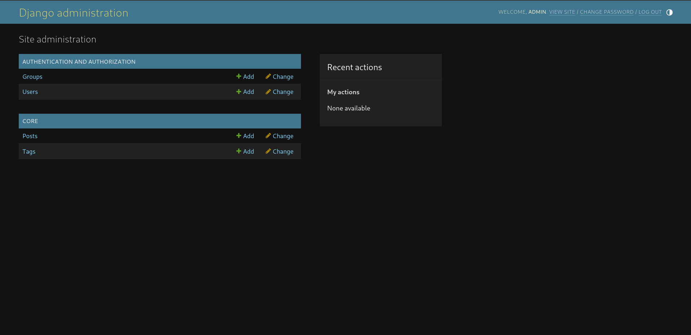
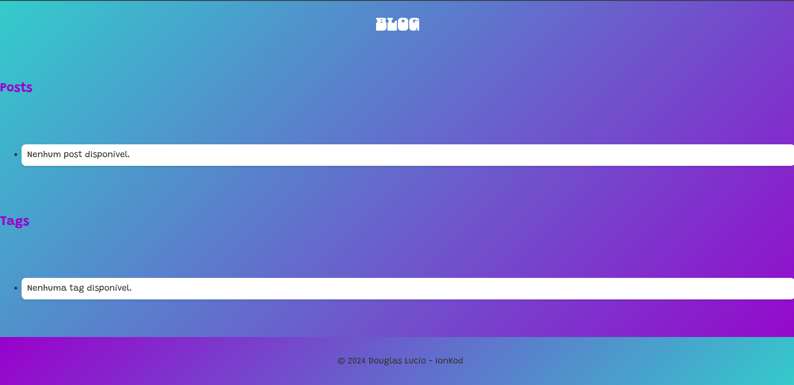

# Blog Django

Este é um projeto que simula um pequeno blog desenvolvido com Django. A aplicação permite a listagem de posts e suas respectivas tags.

## Desafio

Neste desafio, foi solicitado que:

1. **Criar um app Django chamado `core`.**
2. **Modelos:**
   - **Post** com os seguintes campos:
     - `title` (Título do post)
     - `content` (Conteúdo do post)
     - `created_at` (Data de criação)
     - `tags` (Um post pode ter uma ou várias tags)
   - **Tag** com o seguinte campo:
     - `name` (Nome da tag)
3. **Integrar os models no admin do Django.**
4. **Criar uma página acessível pelo path `/blog` que liste todos os posts e tags.**
5. **Utilizar SQLite3 como banco de dados.**
6. **Adicionar controle de versão com Git.**
7. **Cadastrar um usuário no admin com as seguintes credenciais:**
   - Username: `admin`
   - Senha: `admin`

## Estrutura do Projeto

```plaintext
.
├── blog
│   ├── asgi.py
│   ├── __init__.py
│   ├── settings.py
│   ├── urls.py
│   └── wsgi.py
├── core
│   ├── admin.py
│   ├── apps.py
│   ├── migrations
│   │   └── 0001_initial.py
│   ├── models.py
│   ├── templates
│   │   └── core
│   │       └── blog_list.html
│   ├── tests.py
│   ├── urls.py
│   └── views.py
├── db.sqlite3
└── manage.py
```

## Como Executar o Projeto

1. **Clone o repositório:**

   ```bash
   git clone https://github.com/seuusuario/seurepositorio.git
   cd seurepositorio
   ```

2. **Instale as dependências:**

   ```bash
   pip install -r requirements.txt
   ```

3. **Migrate o banco de dados:**

   ```bash
   python manage.py migrate
   ```

4. **Crie um superusuário:**

   ```bash
   python manage.py createsuperuser
   ```

5. **Execute o servidor:**

   ```bash
   python manage.py runserver
   ```

6. **Acesse a aplicação:**
   - Vá para `http://127.0.0.1:8000/blog/` para ver a lista de posts e tags.
   - Vá para `http://127.0.0.1:8000/admin/` para acessar o admin do Django (use as credenciais `admin`/`admin`).

## Imagens






## Licença

---

### MIT License

**Copyright (c) 2024 Douglas Lucio - IonKod**

**Permission is hereby granted, free of charge, to any person obtaining a copy of this software and associated documentation files (the "Software"), to deal in the Software without restriction, including without limitation the rights to use, copy, modify, merge, publish, distribute, sublicense, and/or sell copies of the Software, and to permit persons to whom the Software is furnished to do so, subject to the following conditions:**

- **The above copyright notice and this permission notice shall be included in all copies or substantial portions of the Software.**

- **THE SOFTWARE IS PROVIDED "AS IS", WITHOUT WARRANTY OF ANY KIND, EXPRESS OR IMPLIED, INCLUDING BUT NOT LIMITED TO THE WARRANTIES OF MERCHANTABILITY, FITNESS FOR A PARTICULAR PURPOSE AND NONINFRINGEMENT. IN NO EVENT SHALL THE AUTHORS OR COPYRIGHT HOLDERS BE LIABLE FOR ANY CLAIM, DAMAGES OR OTHER LIABILITY, WHETHER IN AN ACTION OF CONTRACT, TORT OR OTHERWISE, ARISING FROM, OUT OF OR IN CONNECTION WITH THE SOFTWARE OR THE USE OR OTHER DEALINGS IN THE SOFTWARE.**

---


```

### Instruções para Uso

1. **Substitua `https://github.com/seuusuario/seurepositorio.git` pela URL do seu repositório.**
2. **Ajuste as instruções conforme necessário, especialmente se houver dependências específicas ou configurações que você queira mencionar.**

